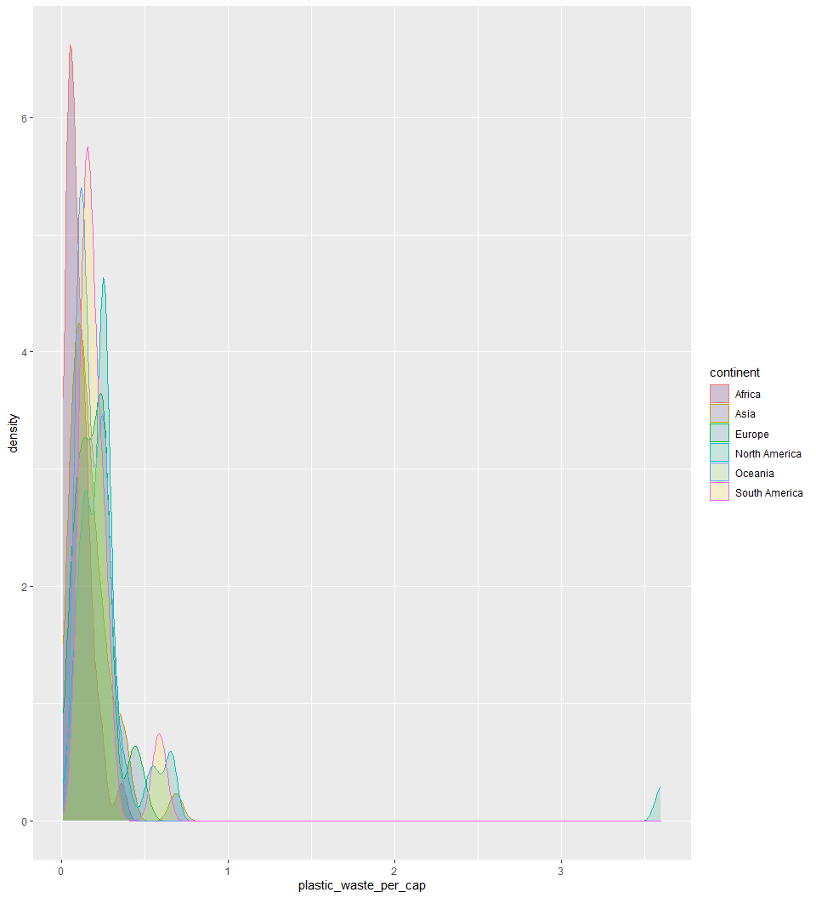
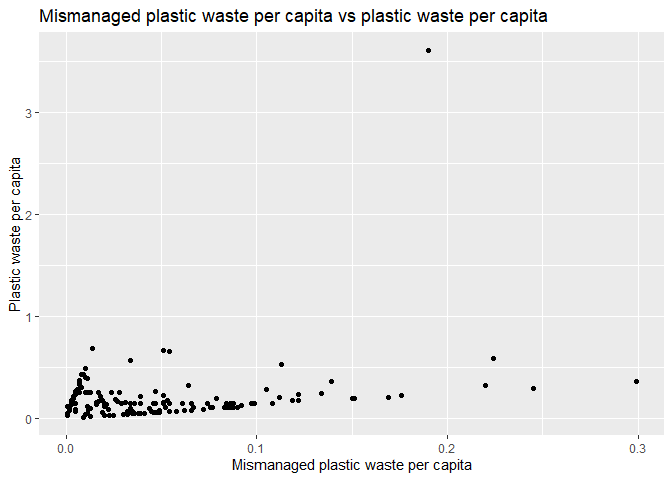
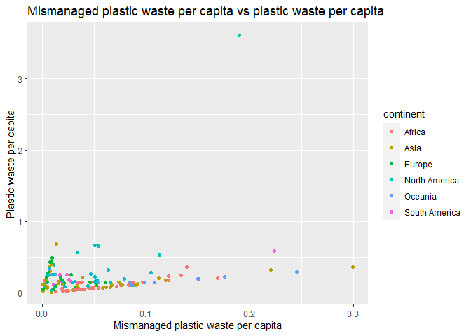
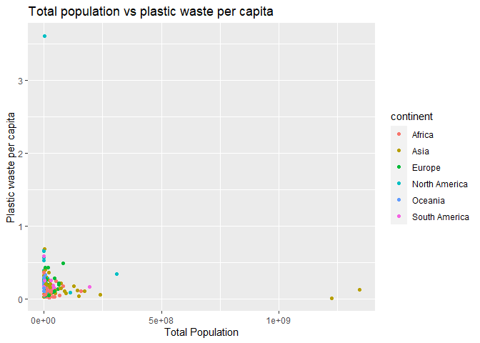
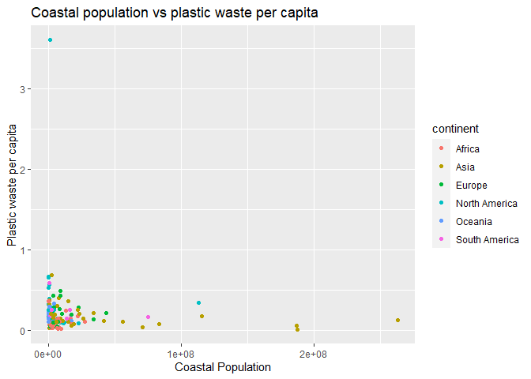

Lab 02 - Plastic waste
================
Lindley Slipetz
02/3/2021

## Load packages and data

``` r
library(tidyverse) 
```

``` r
plastic_waste <- read_csv("data/plastic-waste.csv")
```

## Exercises

### Exercise 1

``` r
ggplot(data = plastic_waste, aes(x = plastic_waste_per_cap)) +
  geom_histogram(binwidth = 0.2)
```

<!-- -->

``` r
plastic_waste %>%
  filter(plastic_waste_per_cap > 3.5)
```

    ## # A tibble: 1 x 10
    ##   code  entity continent  year gdp_per_cap plastic_waste_p~ mismanaged_plas~
    ##   <chr> <chr>  <chr>     <dbl>       <dbl>            <dbl>            <dbl>
    ## 1 TTO   Trini~ North Am~  2010      31261.              3.6             0.19
    ## # ... with 3 more variables: mismanaged_plastic_waste <dbl>, coastal_pop <dbl>,
    ## #   total_pop <dbl>

``` r
ggplot(data = plastic_waste, aes(x = plastic_waste_per_cap)) +
  geom_histogram(binwidth = 0.2) +
  facet_wrap(~continent)
```

<!-- -->

Generally, there are similar trends across continents: most countries
are clusted under 1. The only outlier is Trinidad and Tobago.

### Exercise 2

``` r
ggplot(data = plastic_waste, 
       mapping = aes(x = plastic_waste_per_cap, 
                     color = continent, 
                     fill = continent)) +
  geom_density(alpha = 0.2) +
  scale_fill_viridis_d()
```

    ## Warning: Removed 51 rows containing non-finite values (stat_density).

<!-- -->

The color and fill of the curves were mapped to aesthetics because they
are variable dependent. The alpha level applies to all data (not by
variable), so it is defined in the plotting geom.

### Exercise 3

``` r
ggplot(data = plastic_waste, 
       mapping = aes(x = continent, 
                     y = plastic_waste_per_cap)) +
  geom_boxplot()
```

<!-- -->

``` r
ggplot(data = plastic_waste, 
       mapping = aes(x = continent, 
                     y = plastic_waste_per_cap)) +
  geom_violin()
```

<!-- -->

The violin plots reveal the shape of the distributions, while the box
plots do not. The outliers for continents other than North America are
more apparent in the box plots than the violin plots.

### Exercise 4

``` r
ggplot(data = plastic_waste, 
       mapping = aes(x =       
                 mismanaged_plastic_waste_per_cap,
                     y = plastic_waste_per_cap)) +
  geom_point() +
  labs(title = "Mismanaged plastic waste per capita vs plastic waste per capita",
       x = "Mismanaged plastic waste per capita",
       y = "Plastic waste per capita")
```

<!-- -->

Most of the countries are grouped towards the origin of the graph. There
seems to be a slight positive linear relationship.

### Exercise 5

``` r
ggplot(data = plastic_waste, 
       mapping = aes(x =       
                 mismanaged_plastic_waste_per_cap,
                     y = plastic_waste_per_cap,
                 color = continent)) +
  geom_point() +
  labs(title = "Mismanaged plastic waste per capita vs plastic waste per capita",
       x = "Mismanaged plastic waste per capita",
       y = "Plastic waste per capita")
```

<!-- -->

North America seems to have points with higher plastic waste per capita;
though, for most, they are low in mismanaged plastic waste per capita
(like the other continents). Africa seems to do the best job of
mismanaged plastic waste per capita as the maximum of the its values on
the x axis is lower than the other continents. Asia has the worst
mismanaged plastic waste per capita.

### Exercise 6

At some point, the numbering got messed up. I swear it’s all here.

### Exercise 7

``` r
ggplot(data = plastic_waste, 
       mapping = aes(x =       
                 total_pop,
                     y = plastic_waste_per_cap,
                 color = continent)) +
  geom_point() +
  labs(title = "Total population vs plastic waste per capita",
       x = "Total Population",
       y = "Plastic waste per capita")
```

<!-- -->

``` r
ggplot(data = plastic_waste, 
       mapping = aes(x =       
                 coastal_pop,
                     y = plastic_waste_per_cap,
                 color = continent)) +
  geom_point() +
  labs(title = "Coastal population vs plastic waste per capita",
       x = "Coastal Population",
       y = "Plastic waste per capita")
```

<!-- -->

It’s hard to see the relationship with the outliers included, but it
seems that coastal population has the potential to have more of a linear
relationship with plastic waste per capita. For total population, most
of the points are grouped at the origin, while, for coastal population,
there is more spread across the x-axis.

### Exercise 8

Remove this text, and add your answer for Exercise 8 here.

``` r
# insert code here
```
