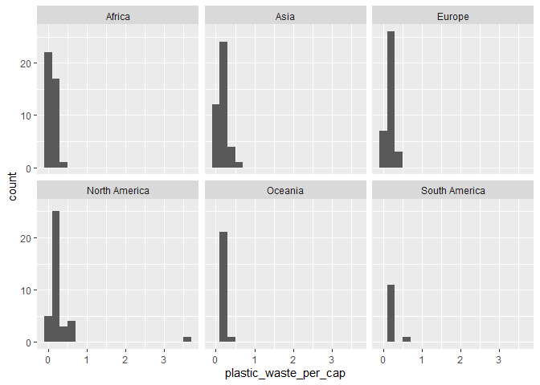

Lab 02 - Plastic waste
================
Lindley Slipetz
02/3/2021

## Load packages and data

``` r
library(tidyverse) 
```

``` r
plastic_waste <- read_csv("data/plastic-waste.csv")
```

## Exercises

### Exercise 1

``` r
ggplot(data = plastic_waste, aes(x = plastic_waste_per_cap)) +
  geom_histogram(binwidth = 0.2)
```

<!-- -->

``` r
plastic_waste %>%
  filter(plastic_waste_per_cap > 3.5)
```

    ## # A tibble: 1 x 10
    ##   code  entity continent  year gdp_per_cap plastic_waste_p~ mismanaged_plas~
    ##   <chr> <chr>  <chr>     <dbl>       <dbl>            <dbl>            <dbl>
    ## 1 TTO   Trini~ North Am~  2010      31261.              3.6             0.19
    ## # ... with 3 more variables: mismanaged_plastic_waste <dbl>, coastal_pop <dbl>,
    ## #   total_pop <dbl>

``` r
ggplot(data = plastic_waste, aes(x = plastic_waste_per_cap)) +
  geom_histogram(binwidth = 0.2) +
  facet_wrap(~continent)
```

<!-- -->

Generally, there are similar trends across continents: most countries
are clusted under 1. The only outlier is Trinidad and Tobago.

### Exercise 2

``` r
# insert code here
```

### Exercise 3

Remove this text, and add your answer for Exercise 3 here.

### Exercise 4

Remove this text, and add your answer for Exercise 4 here.

``` r
# insert code here
```

### Exercise 5

Remove this text, and add your answer for Exercise 5 here.

``` r
# insert code here
```

### Exercise 6

Remove this text, and add your answer for Exercise 6 here.

``` r
# insert code here
```

### Exercise 7

Remove this text, and add your answer for Exercise 7 here.

``` r
# insert code here
```

``` r
# insert code here
```

### Exercise 8

Remove this text, and add your answer for Exercise 8 here.

``` r
# insert code here
```
